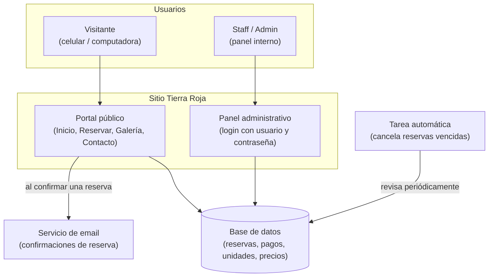
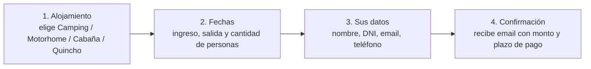

# Tierra Roja — Documentación del Proyecto

**Camping y Parque Acuático, Puerto Iguazú (Misiones)**
Última actualización: 12 de agosto de 2026

Este documento describe, en lenguaje no técnico, qué es el sistema, qué funcionalidades incluye, cómo está construido a grandes rasgos y cómo se usa en el día a día. No incluye detalles de código ni de configuración de servidores — esa información vive en el repositorio del proyecto para el equipo de desarrollo.

## Índice

1. [Resumen del proyecto](#1-resumen-del-proyecto)
2. [Funcionalidades principales](#2-funcionalidades-principales)
3. [Tipos de alojamiento](#3-tipos-de-alojamiento)
4. [Arquitectura a alto nivel](#4-arquitectura-a-alto-nivel)
5. [Cómo usar el sistema](#5-cómo-usar-el-sistema)
6. [Reglas de negocio importantes](#6-reglas-de-negocio-importantes)
7. [Glosario](#7-glosario)
8. [Pendientes antes de salir a producción](#8-pendientes-antes-de-salir-a-producción)

---

## 1. Resumen del proyecto

El proyecto está formado por **dos partes que comparten la misma base de datos**:

| | Para quién | Qué permite |
|---|---|---|
| **Portal público** | Visitantes / futuros huéspedes | Conocer el predio, ver fotos, reservar alojamiento online sin necesidad de crear una cuenta |
| **Panel administrativo** | Equipo de Tierra Roja (Staff y Administración) | Gestionar todas las reservas, registrar pagos, hacer check-in/check-out, ver ocupación y reportes |

Ambas partes están **conectadas en tiempo real**: una reserva hecha por un visitante desde el celular aparece al instante en el panel del staff, y una reserva cargada manualmente por el staff (por ejemplo, un cliente que llama por teléfono) también descuenta disponibilidad para el sitio público. No hay planillas paralelas ni doble carga de datos.

---

## 2. Funcionalidades principales

### 2.1 Portal público (sitio web para visitantes)

| Página | Contenido |
|---|---|
| **Inicio** (`/`) | Presentación del predio: piscinas, camping, motorhome y cabaña, con llamados a la acción hacia la reserva |
| **Reservar** (`/reservar`) | Reserva online en 4 pasos, sin necesidad de cuenta ni contraseña |
| **Galería** (`/galeria`) | Fotos del predio organizadas por categoría (Naturaleza, Piscinas, Camping, Cabañas) |
| **Atractivos de Iguazú** (`/atractivos`) | Guía de qué hacer en Puerto Iguazú: las 34 fichas del descriptivo oficial de la ACATI y el mapa de la ciudad para ver y descargar. Se llega desde el botón de la sección "Ubicación" del inicio; no está en el menú |
| **Contacto** (`/contacto`) | Datos de contacto, formulario de consultas, ubicación y horarios |
| **Política de Privacidad** (`/politica-de-privacidad`) | Cómo se usan y protegen los datos de los huéspedes |

### 2.2 Panel administrativo (equipo de Tierra Roja)

Acceso mediante usuario y contraseña, con **dos niveles de permisos**:

- **Staff**: uso diario — ver llegadas/salidas de hoy, buscar una reserva, cargar una reserva manual (por teléfono o en el mostrador), y ver quién debe pagar.
- **Admin**: todo lo anterior, más las herramientas de gestión del negocio — vista operativa general, calendario de ocupación, configuración de precios y cupos, y reportes.

| Sección | Rol | Qué permite |
|---|---|---|
| **Hoy** | Staff / Admin | Ver quién llega y quién se va hoy |
| **Buscar** | Staff / Admin | Encontrar una reserva por nombre o DNI |
| **Nueva reserva** | Staff / Admin | Cargar manualmente una reserva (mismo formulario que usa el visitante, pero pensado para que lo complete el staff) |
| **Pendientes de pago** | Staff / Admin | Listado de reservas confirmadas que todavía no transfirieron la seña |
| **Detalle de una reserva** | Staff / Admin | Ver los datos completos, registrar un pago, hacer check-in o check-out |
| **Vista operativa** | Admin | Panorama general del día (llegadas, salidas, pagos pendientes) y ocupación actual por tipo de alojamiento |
| **Calendario de ocupación** | Admin | Ver, mes a mes, qué lugares están ocupados y por quién, y crear reservas directamente desde el calendario |
| **Configuración** | Admin | Editar cupos, precios y plazos de pago sin intervención del equipo de desarrollo |
| **Reportes** | Admin | Números del mes: facturación, noches ocupadas, cantidad de reservas, canal de captación |

### 2.3 Automatizaciones

El sistema hace, sin intervención humana:

- **Email de confirmación**: cuando alguien reserva desde el sitio público, recibe automáticamente un mail con el resumen de su reserva, el monto a transferir y el plazo para hacerlo.
- **Cancelación automática por falta de pago**: si una reserva hecha por el sitio web no se paga dentro del plazo indicado, el sistema la cancela sola y libera el lugar para otro interesado (el detalle de esta regla está en la [sección 6](#6-reglas-de-negocio-importantes)).

---

## 3. Tipos de alojamiento

El sistema gestiona cuatro tipos de alojamiento, cada uno con sus propias reglas de disponibilidad:

| Tipo | Cómo se reserva | Particularidad |
|---|---|---|
| **Camping** | Por cupo general (cantidad de personas) | No tiene "lugares" numerados; se controla por cantidad total de personas admitidas por noche |
| **Motorhome** | Por parcela | Hay 25 parcelas; el sistema asigna automáticamente una libre, el cliente no elige el número |
| **Cabaña** | Unidad única | Solo hay una cabaña disponible; capacidad máxima 8 personas |
| **Quincho** | Por categoría (Chico / Grande / Especial / Compartido) | Se reserva por día (no por noche); el cliente elige la categoría y el sistema muestra los quinchos libres de esa categoría |

**Piscinas / parque acuático**: hoy es un **beneficio informativo e incluido**, no un ítem que se reserve aparte. Se muestra en la página de inicio como atractivo del predio y está incluido al reservar la cabaña. Si el negocio vende "pase de día" para usar solo las piscinas (se menciona un horario de 9 a 19hs en la página de Contacto), esa venta hoy se gestiona fuera del sistema — no hay reserva, cupo ni cobro digital para esa modalidad todavía.

---

## 4. Arquitectura a alto nivel

El sitio está construido como una **aplicación web moderna**, sin instalación de software para el equipo: todo funciona desde el navegador, tanto para los visitantes como para el staff.

**En criollo:**

- El **sitio** (portal público + panel) está construido con **Astro**, un framework web moderno pensado para que las páginas carguen rápido.
- Toda la información (reservas, pagos, precios, cupos) vive en una **base de datos en la nube** (Supabase), a la que acceden tanto el portal público como el panel — por eso los cambios se reflejan al instante en los dos lados.
- El **envío de emails de confirmación** lo hace un servicio especializado (Resend), separado de la base de datos.
- El sitio está **publicado en Vercel**, un servicio de hosting que lo mantiene siempre disponible y lo actualiza automáticamente cada vez que se publica una mejora.
- Existe una **tarea automática** que corre sola, sin que nadie tenga que ejecutarla, y que se encarga de cancelar las reservas que quedaron sin pagar vencido el plazo.

Esta arquitectura no requiere que el camping mantenga servidores propios ni instale nada: todo el mantenimiento técnico de la infraestructura corre por cuenta de estos servicios externos.

---

## 5. Cómo usar el sistema

### 5.1 Cómo reserva un visitante (portal público)

No hace falta crear una cuenta ni ingresar una contraseña. El pago **no se hace en el sitio**: el visitante confirma la reserva, recibe por email los datos para transferir la seña, y el equipo de Tierra Roja verifica y registra el pago manualmente desde el panel una vez recibida la transferencia.

### 5.2 Trabajo diario del Staff (panel)

1. **Ingresar** a `/panel/login` con usuario y contraseña.
2. La pantalla de inicio ("Hoy") muestra de un vistazo **quién llega y quién se va** en el día.
3. Desde **Buscar**, se localiza cualquier reserva por nombre o DNI para consultarla o modificarla.
4. Desde el **detalle de una reserva** se puede:
   - Registrar un pago (total o parcial) una vez confirmada la transferencia.
   - Hacer **check-in** (habilitado apenas hay algún pago registrado, aunque sea parcial).
   - Hacer **check-out** (habilitado solo cuando el pago está completo).
5. **Nueva reserva** permite cargar a mano una reserva de un cliente que llamó por teléfono o se acercó al mostrador — usa el mismo formulario que el sitio público, pero sin exigir email/teléfono y sin plazo de pago automático (se asume que ya hay una persona del camping coordinando en vivo).
6. **Pendientes de pago** lista todas las reservas confirmadas que todavía deben transferir la seña, ordenadas por urgencia.

### 5.3 Herramientas de Administración

Todo lo anterior, más:

- **Vista operativa**: un resumen ejecutivo del día — llegadas, salidas, pagos pendientes, y la ocupación actual de cada tipo de alojamiento (por ejemplo, "3 de 25 motorhomes ocupados"). Cada fila de ocupación lleva directo al calendario de ese tipo de alojamiento.

- **Calendario de ocupación**: la herramienta visual para planificar. Se navega por pestañas (Camping / Motorhome / Cabaña / Quinchos) y muestra, día por día, quién ocupa cada lugar:

  - Cada **fila** es un lugar físico real (por ejemplo, cada parcela de motorhome) o, para Camping, un "carril" virtual que representa un cupo disponible.
  - Cada **reserva** se ve como una barra de color a lo largo de las fechas que ocupa, con un color según su estado: **Reserva** (confirmada, azul), **Checkin** (huésped ya ingresó, verde), **Adeudado** (todavía debe plata, ámbar) y **Checkout** (estadía finalizada, marrón). Tocar una barra abre el detalle de esa reserva.
  - Por defecto el calendario **arranca en el día de hoy** (los días que ya pasaron no ayudan a decidir dónde ubicar una reserva nueva), pero hay un botón para volver a ver los días anteriores del mes si hace falta consultarlos.
  - **Se puede crear una reserva directamente desde el calendario**: clickeando (o arrastrando el mouse sobre varias fechas) en una celda vacía, el sistema abre el formulario de "Nueva reserva" con el tipo de alojamiento y las fechas ya precargadas — solo falta completar los datos del huésped.

- **Configuración**: permite editar, sin tocar código, los cupos de cada tipo de alojamiento, los precios por ítem (por ejemplo, precio por acompañante o por categoría de quincho) y los plazos de pago (cuántas horas tiene un cliente para transferir según cuán próxima esté la fecha de su reserva).

- **Reportes**: números del mes en curso — total facturado, noches ocupadas, cantidad de reservas y por qué canal se enteraron los clientes del camping (dato que se pide al reservar).

---

## 6. Reglas de negocio importantes

- **El pago es siempre por transferencia**, verificada manualmente por el staff. El sistema **no procesa tarjetas ni pagos online** — no se piden ni almacenan datos de tarjeta en ningún momento.

- **Plazo de pago y cancelación automática**: al confirmar una reserva desde el sitio público, se le asigna un plazo para transferir la seña:
  - Si falta **3 días o más** para la fecha de ingreso, el plazo es más largo (48 horas por defecto).
  - Si falta **menos de 3 días**, el plazo es más corto (6 horas por defecto), porque hay menos margen para reaccionar.
  - Estos números son **configurables** desde el panel (sección Configuración), sin necesidad de tocar código.
  - Si el plazo vence y la reserva sigue sin pagarse, el sistema la **cancela automáticamente** y libera el lugar. Esta regla aplica solo a reservas hechas por el sitio web; las cargadas manualmente por el staff no vencen solas.

- **Check-in y check-out están condicionados al pago**:
  - Check-in: requiere que haya al menos un pago registrado (total o parcial).
  - Check-out: requiere que el pago esté completo.

- **Reservas manuales vs. web**: el sistema distingue si una reserva vino del sitio público o fue cargada por el staff. Esto es lo que determina, por ejemplo, si aplica o no el plazo de pago automático.

- **Menores de edad**: solo personas mayores de 18 años pueden hacer una reserva (aclarado en la Política de Privacidad).

---

## 7. Glosario

| Término | Significado |
|---|---|
| **Unidad** | Cada uno de los cuatro tipos de alojamiento (Camping, Motorhome, Cabaña, Quincho) |
| **Parcela** | Un lugar físico específico dentro de una unidad (por ejemplo, "Parcela 7" de Motorhome) |
| **Cupo** | Cantidad máxima de personas o lugares disponibles para un tipo de alojamiento sin lugares numerados (Camping) |
| **Seña** | El pago (total o parcial) que confirma una reserva |
| **Check-in** | Registro de ingreso del huésped al predio |
| **Check-out** | Registro de salida del huésped |
| **Origen (WEB / Manual)** | Si la reserva la hizo el visitante desde el sitio, o si la cargó el staff |
| **Staff / Admin** | Los dos niveles de acceso al panel: uso diario, y gestión avanzada del negocio |

---

## 8. Pendientes antes de salir a producción

Durante la preparación de esta documentación se detectaron algunos contenidos de relleno (placeholders) y datos inconsistentes entre distintas páginas del sitio, que conviene resolver antes del lanzamiento definitivo:

1. **Dirección del predio inconsistente**: la página de Contacto muestra "Av. de las Cataratas 2000 Ha" mientras que el pie de página y la Política de Privacidad muestran "Barrio Los Yerbales 2000 Ha". Hay que definir cuál es la correcta.
2. **Email de contacto inconsistente**: `tierrarojaiguazu@gmail.com` (página de Contacto) vs. `hola@tierraroja.com.ar` (pie de página y Política de Privacidad).
3. **Número de WhatsApp inconsistente**: el pie de página usa un número distinto al de la página de Contacto, y este último todavía tiene un enlace sin completar (`wa.me/yourwhatsapp`).
4. **Formulario de contacto no está conectado**: hoy el formulario de la página de Contacto es solo visual — al enviarlo, no le llega el mensaje a nadie. Falta definir a dónde debe llegar (email, WhatsApp Business, etc.) y conectarlo.
5. **Datos bancarios pendientes en el email de confirmación**: el mail que recibe el cliente al reservar todavía tiene un texto de relleno donde deberían ir el CBU/alias real y el WhatsApp de contacto para modificar o cancelar una reserva.
6. **Páginas enlazadas pero no creadas**: el pie de página tiene links a "Normas del Parque" y "Términos y Condiciones" que todavía no existen como páginas.
7. **Sin sección propia de Quinchos en la página de Inicio**: hoy los Quinchos solo aparecen dentro del formulario de reserva, no se promocionan en la home como sí pasa con Camping, Motorhome y Cabaña.
8. **Contenido e imágenes de relleno**: hay texto "Lorem ipsum" sin reemplazar en Contacto, un precio de ejemplo en la sección de Cabaña, y varias fotos de stock (no propias del predio) en la Galería y en la sección de Cabaña.

Ninguno de estos puntos afecta el funcionamiento del sistema de reservas — son contenidos de texto/imagen y datos de contacto que se completan sin necesidad de cambios de fondo.
